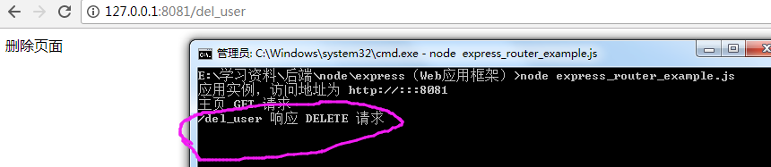

首先 要安装相关包:

--save只本项目下	

‘‘‘JavaScript

npm install express --save

npm install body-parser --save
  
npm install cookie-parser --save

npm install multer --save

‘‘‘		

<h5> 查看所安装的express版本以及位置

<h5> 其中express_demo.js的实例演示结果为：

<h5> express路由实例：

正则匹配的网址内容，满足ab*cd.html即可

<h5> express的static静态文件

<h5> get测试

提交之后：

<h5> post测试

提交之后：

